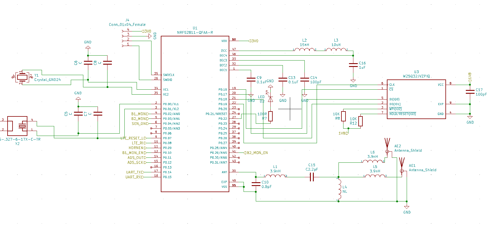

### Description
The purpose of this repo is to interface 24-bit ADC for bridge sensors 
`ADS1231` IC with `nRF52811` SoC. \
The data from `ADS1231` will be readed in single shots by `nRF52811`.

###### Schematics
Below are schematics showing how `ADS1231` is interfaced with `nRF52811`:

From `ADS1231` side:

From `nRF52811` side:

