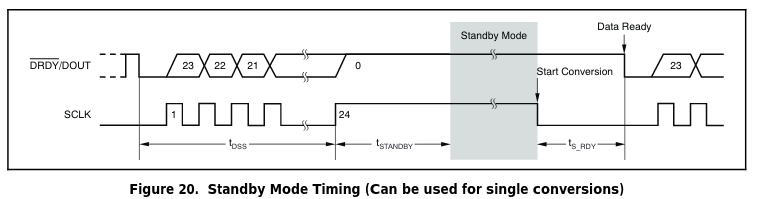

##### ADS1231 features

###### ADS1231 data rate
The `ADS1231` data rate is set by the `SPEED` pin(4). When the `SPEED` is low,
the data rate is nominally 10SPS. But if it is high then data rate is 80SPS.

###### ADS1231 data format
The `ADS1231` outputs 24 bits of data in binary two's complement format. The
LSB has weight of (0.5V\_ref/128)(2^23 - 1). The positive full scale input
produces an output code of `0x7fffff` and negative full-scale input produces
an output code of `0x800000`. The output clips at these codes for signals
exceeding full-scale.
| Input signal Vin         | Ideal output |
|:------------------------:|:------------:|
| >= +0.5Vref/128          | 0x7fffff     |
| (+0.5vref/128)(2^23 - 1) | 0x000001     |
| 0                        | 0x000000     |
| (-0.5vref/128)(2^23 - 1) | 0xffffff     |
| <= -0.5Vref/128          | 0x800000     |

###### ADS1231 `#DRDY/DOUT` pin
This digital pin serves two purposes. First, it indicates when new data are
ready by going low. Afterwards, on the first rising edge of `SCLK`, the
`#DRDY/DOUT` pin changes function and begins outputting the conversion data,
MSB first. Data are shifted out on each subsequent `SCLK` rising edge. After
all 24 bits have been retrieved, the pin can be forced high with an additional
`SCLK`. It then stays high until new data are ready.

###### ADS1231 Standby Mode Timing( cna be used for single conversions)
To enter Standby mode, simply hold `SCLK` high. Standby mode can be initiated
at any time during readback; it is not necessary to retrieve all 24 bits of
data beforehand. When t\_standby has passed with `SCLK` held high, Standby
mode activates. `#DRDY/DOUT` stays high when Standby mode begins. `SCLK` must
remain high to stay in Standby mode. To exit Standby mode, set `SCLK` low.

